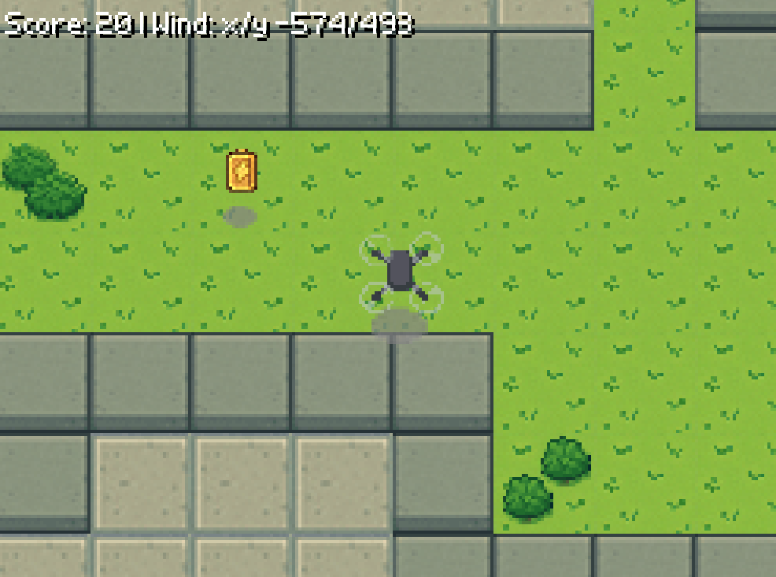

# RetroFlight — UAV Simulation

A 2D top-down UAV simulation built with Python, NumPy, and Pygame.



---

## Requirements

- Python 3.8 or newer — download from [python.org](https://www.python.org/downloads/)
  - ⚠️ Windows: check **"Add Python to PATH"** during installation!

---

## Setup & Run

### Windows (recommended)

1. Double-click **`setup.bat`** — installs everything (only needed once)
2. Double-click **`run.bat`** — starts the simulation

### Linux / macOS

1. Installation

```bash
source setup.sh
```

2. Run

```bash
source env.sh
python -m retroflight.main
```

---

## Controls

| Key | Action |
|---|---|
| `W / A / S / D` or arrow keys | Move UAV |
| `Q` | Ascend |
| `E` | Descend |
| `Escape` | Quit |

---

## External Controller (Mission Script)

The simulation exposes a TCP API on `localhost:5000`.  
You can send waypoint commands from a separate script while the simulation is running.

**Start the simulation first**, then open a second terminal (with the venv active) and run:

```bash
python external_control/my_mission.py
```

The mission script sends JSON commands like:

```json
{"cmd": "go_to", "x": 5.0, "y": 3.0, "z": 1.0}
```

Coordinates are in **meters** (1 meter = 1 tile).

---

## Modifying the Waypoint Controller

The UAV's onboard low-level controller lives in:

```
src/retroflight/controller.py
```

